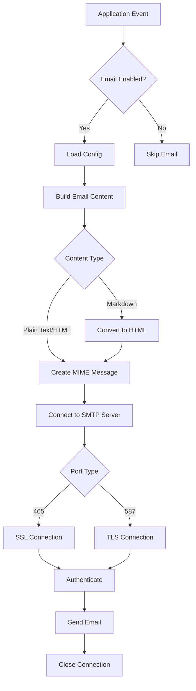
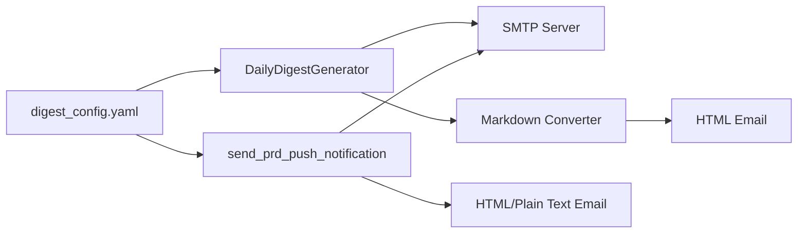

# Email Implementation Technical Documentation

## Table of Contents

1. [Executive Summary](#executive-summary)
2. [Architecture Overview](#architecture-overview)
3. [Configuration System](#configuration-system)
4. [Implementation Details](#implementation-details)
5. [Markdown to HTML Conversion](#markdown-to-html-conversion)
6. [Code Examples](#code-examples)
7. [Security Considerations](#security-considerations)
8. [Testing & Troubleshooting](#testing--troubleshooting)
9. [Integration Guide](#integration-guide)
10. [Configuration Files Reference](#configuration-files-reference)

---

## Executive Summary

This document provides a comprehensive technical reference for the email functionality implemented in the Hunter application. The implementation uses Python's standard library modules (`smtplib` and `email`) to send emails via SMTP, requiring **no additional dependencies** beyond what's already in the project.

### Key Technologies

- **Python `smtplib`**: SMTP client for sending emails
- **Python `email` package**: Email message construction (`MIMEText`, `MIMEMultipart`, `MIMEBase`)
- **YAML configuration**: Configuration-driven email settings
- **Standard library only**: No external email libraries required

### Use Cases

The email functionality is used in two primary scenarios:

1. **Daily Digest Emails**: Automated daily summaries of job hunting activities
2. **PRD Push Notifications**: Email notifications for static search page deployment status

### Files Involved

- **Configuration**: `/Users/kervinleacock/Documents/Development/hunter/config/digest_config.yaml` (actual config file, based on example at `/Users/kervinleacock/Documents/Development/hunter/config/digest_config.yaml.example`)
- **Daily Digest Implementation**: `/Users/kervinleacock/Documents/Development/hunter/scripts/generate_daily_digest.py`
- **PRD Push Implementation**: `/Users/kervinleacock/Documents/Development/hunter/app/web.py`
- **Utility Functions**: `/Users/kervinleacock/Documents/Development/hunter/app/utils/file_utils.py` (for YAML loading)

---

## Architecture Overview

### High-Level Flow



### Component Relationships



### Configuration-Driven Design

Both implementations share the same configuration file pattern:

- **Configuration file**: `/Users/kervinleacock/Documents/Development/hunter/config/digest_config.yaml`
- **Shared settings**: SMTP server, credentials, sender/recipient
- **Feature flag**: `email.enabled` toggles email functionality
- **Provider flexibility**: Supports multiple email providers (Zoho, Gmail, Outlook, Yahoo, custom SMTP)

---

## Configuration System

### Configuration File Location

**Primary Config File**: `/Users/kervinleacock/Documents/Development/hunter/config/digest_config.yaml`  
**Example Template**: `/Users/kervinleacock/Documents/Development/hunter/config/digest_config.yaml.example`

### Configuration Schema

The configuration file follows this YAML structure:

```yaml
email:
  enabled: false                    # Boolean: Enable/disable email functionality
  smtp_server: smtp.zoho.com       # String: SMTP server hostname
  smtp_port: 587                   # Integer: SMTP port (587 for TLS, 465 for SSL)
  sender_email: "your-email@zoho.com"  # String: Email address to send from
  sender_password: "your-password"     # String: Email password or app-specific password
  recipient_email: "recipient@example.com"  # String: Email address to send to
  subject: "Daily Job Hunt Digest"    # String: Default email subject line

output:
  include_skills_analysis: false   # Boolean: Include skills analysis in digest
  include_full_analytics: true     # Boolean: Include full analytics metrics
```

### Loading Configuration

Both implementations load configuration using a shared pattern:

**Daily Digest** (`/Users/kervinleacock/Documents/Development/hunter/scripts/generate_daily_digest.py`):
```python
def _load_config(self, config_path: Path) -> Dict:
    """Load configuration from YAML file"""
    if config_path.exists():
        return load_yaml(config_path)
    else:
        # Return default config
        return {
            'email': {
                'enabled': False,
                'smtp_server': 'smtp.gmail.com',
                'smtp_port': 587,
                'sender_email': '',
                'sender_password': '',
                'recipient_email': '',
                'subject': 'Daily Job Hunt Digest'
            },
            'output': {
                'include_skills_analysis': False,
                'include_full_analytics': True
            }
        }
```

**PRD Push** (`/Users/kervinleacock/Documents/Development/hunter/app/web.py`):
```python
config_path = get_project_root() / 'config' / 'digest_config.yaml'
if not config_path.exists():
    return False

config = load_yaml(config_path)
email_config = config.get('email', {})

if not email_config.get('enabled', False):
    return False
```

### Email Provider Configurations

#### Zoho Mail (Personal Account)

```yaml
email:
  enabled: true
  smtp_server: smtp.zoho.com
  smtp_port: 587
  sender_email: "your-email@zoho.com"
  sender_password: "your-app-specific-password"
  recipient_email: "your-email@zoho.com"
  subject: "Daily Job Hunt Digest"
```

#### Zoho Mail (Organization/Enterprise)

```yaml
email:
  enabled: true
  smtp_server: smtppro.zoho.com
  smtp_port: 587
  sender_email: "your-email@yourdomain.com"
  sender_password: "your-app-specific-password"
  recipient_email: "your-email@yourdomain.com"
  subject: "Daily Job Hunt Digest"
```

#### Gmail

```yaml
email:
  enabled: true
  smtp_server: smtp.gmail.com
  smtp_port: 587
  sender_email: "your-email@gmail.com"
  sender_password: "your-app-specific-password"  # REQUIRED: Must use app password
  recipient_email: "recipient@gmail.com"
  subject: "Daily Job Hunt Digest"
```

#### Outlook/Hotmail

```yaml
email:
  enabled: true
  smtp_server: smtp-mail.outlook.com
  smtp_port: 587
  sender_email: "your-email@outlook.com"
  sender_password: "your-password"
  recipient_email: "recipient@outlook.com"
  subject: "Daily Job Hunt Digest"
```

#### Yahoo Mail

```yaml
email:
  enabled: true
  smtp_server: smtp.mail.yahoo.com
  smtp_port: 587
  sender_email: "your-email@yahoo.com"
  sender_password: "your-app-specific-password"  # REQUIRED: Must use app password
  recipient_email: "recipient@yahoo.com"
  subject: "Daily Job Hunt Digest"
```

#### Custom SMTP Server

```yaml
email:
  enabled: true
  smtp_server: mail.yourdomain.com
  smtp_port: 587  # or 465 for SSL
  sender_email: "your-email@yourdomain.com"
  sender_password: "your-password"
  recipient_email: "recipient@yourdomain.com"
  subject: "Daily Job Hunt Digest"
```

---

## Implementation Details

### Daily Digest Email Implementation

**Location**: `/Users/kervinleacock/Documents/Development/hunter/scripts/generate_daily_digest.py`  
**Class**: `DailyDigestGenerator`  
**Method**: `send_email()`

#### Method Signature

```232:288:/Users/kervinleacock/Documents/Development/hunter/scripts/generate_daily_digest.py
    def send_email(self, digest_content: str, digest_path: Optional[Path] = None) -> bool:
        """Send digest via email
        
        Args:
            digest_content: The markdown content of the digest
            digest_path: Optional path to digest file (used for attachment if email fails)
        """
        email_config = self.config.get('email', {})
        
        if not email_config.get('enabled', False):
            return False
        
        try:
            # Convert markdown to HTML (simple conversion)
            html_content = self._markdown_to_html(digest_content)
            
            # Create email
            msg = MIMEMultipart()
            msg['From'] = email_config['sender_email']
            msg['To'] = email_config['recipient_email']
            msg['Subject'] = email_config.get('subject', 'Daily Job Hunt Digest')
            
            # Add HTML body
            msg.attach(MIMEText(html_content, 'html'))
            
            # Attach markdown file if path is provided
            if digest_path and digest_path.exists():
                with open(digest_path, 'rb') as f:
                    part = MIMEBase('application', 'octet-stream')
                    part.set_payload(f.read())
                    encoders.encode_base64(part)
                    part.add_header(
                        'Content-Disposition',
                        f'attachment; filename= {digest_path.name}'
                    )
                    msg.attach(part)
            
            # Send email
            smtp_port = email_config.get('smtp_port', 587)
            
            # Use SSL for port 465, TLS for port 587
            if smtp_port == 465:
                server = smtplib.SMTP_SSL(email_config['smtp_server'], smtp_port)
            else:
                server = smtplib.SMTP(email_config['smtp_server'], smtp_port)
                server.starttls()
            
            server.login(email_config['sender_email'], email_config['sender_password'])
            server.send_message(msg)
            server.quit()
            
            print(f"✅ Email sent to {email_config['recipient_email']}")
            return True
            
        except Exception as e:
            print(f"❌ Error sending email: {e}")
            return False
```

#### Key Features

1. **Feature Flag Check**: Verifies `email.enabled` before proceeding
2. **Markdown to HTML**: Converts markdown content to HTML using custom converter
3. **File Attachments**: Optionally attaches the original markdown file
4. **SSL/TLS Support**: Automatically selects SSL (port 465) or TLS (port 587)
5. **Error Handling**: Catches exceptions and returns boolean status

#### Implementation Flow

1. Load email configuration from `self.config`
2. Check if email is enabled
3. Convert markdown content to HTML
4. Create `MIMEMultipart` message
5. Set From, To, and Subject headers
6. Attach HTML body as `MIMEText`
7. Optionally attach markdown file as base64-encoded attachment
8. Connect to SMTP server (SSL or TLS based on port)
9. Authenticate with credentials
10. Send message
11. Close connection
12. Return success/failure status

#### Required Imports

```11:15:/Users/kervinleacock/Documents/Development/hunter/scripts/generate_daily_digest.py
import smtplib
from email.mime.text import MIMEText
from email.mime.multipart import MIMEMultipart
from email.mime.base import MIMEBase
from email import encoders
```

### PRD Push Notification Implementation

**Location**: `/Users/kervinleacock/Documents/Development/hunter/app/web.py`  
**Function**: `send_prd_push_notification()`

#### Function Signature

```333:477:/Users/kervinleacock/Documents/Development/hunter/app/web.py
def send_prd_push_notification(success: bool, message: str, git_pushed: bool = False, git_committed: bool = False, git_error: str = None):
    """Send email notification for Prd Push using the same config as daily digest"""
    try:
        # Load email configuration from digest_config.yaml (same as daily digest)
        config_path = get_project_root() / 'config' / 'digest_config.yaml'
        if not config_path.exists():
            return False
        
        config = load_yaml(config_path)
        email_config = config.get('email', {})
        
        if not email_config.get('enabled', False):
            return False
        
        # Build email content
        subject = "Prd Push - Static Search Page Generation"
        
        if success:
            if git_pushed:
                status_emoji = "✅"
                status_text = "SUCCESSFUL"
                body_text = f"""
Static search page generated successfully!

{status_emoji} Committed and pushed to GitHub
{status_emoji} Netlify will auto-deploy shortly

The page will be available at:
https://hunter.kervinapps.com/kpro

Details:
{message}
"""
            elif git_committed:
                status_emoji = "⚠️"
                status_text = "PARTIAL SUCCESS"
                body_text = f"""
Static search page generated successfully.

{status_emoji} Committed to git (push failed)

You may need to push manually:
git push origin main

Git error: {git_error or 'Unknown error'}

Details:
{message}
"""
            elif git_error and ('already up to date' in git_error.lower() or 'no changes detected' in git_error.lower()):
                status_emoji = "✅"
                status_text = "UP TO DATE"
                body_text = f"""
Static search page generated successfully.

{status_emoji} File generated and copied
{status_emoji} File is already up to date in git
{status_emoji} Page should be live at: https://hunter.kervinapps.com/kpro

Details:
{message}
"""
            else:
                status_emoji = "⚠️"
                status_text = "GENERATED (GIT FAILED)"
                body_text = f"""
Static search page generated successfully.

{status_emoji} File copied to hunterapp_demo/kpro/index.html

Git operations failed. You may need to commit and push manually:
git add hunterapp_demo/kpro/index.html
git commit -m "Update kpro"
git push origin main

Git error: {git_error or 'Unknown error'}

Details:
{message}
"""
        else:
            status_emoji = "❌"
            status_text = "FAILED"
            body_text = f"""
Static search page generation failed.

{status_emoji} Error: {message}

Please check the server logs for more details.
"""
        
        # Add HTML body with basic formatting
        html_content = f"""
        <html>
        <head>
            <style>
                body {{ font-family: Arial, sans-serif; line-height: 1.6; color: #333; }}
                .status {{ font-size: 18px; font-weight: bold; margin: 20px 0; }}
                .details {{ background-color: #f4f4f4; padding: 15px; border-radius: 5px; margin: 20px 0; }}
                .url {{ color: #0066cc; text-decoration: none; }}
                pre {{ background-color: #f9f9f9; padding: 10px; border-left: 3px solid #ccc; overflow-x: auto; white-space: pre-wrap; }}
            </style>
        </head>
        <body>
            <h2>{subject}</h2>
            <div class="status">{status_emoji} Status: {status_text}</div>
            <div class="details">
                <pre>{body_text}</pre>
            </div>
        </body>
        </html>
        """
        
        # Create multipart message with both HTML and plain text
        msg = MIMEMultipart('alternative')
        msg['From'] = email_config['sender_email']
        msg['To'] = email_config['recipient_email']
        msg['Subject'] = f"{subject} - {status_text}"
        
        # Add plain text version
        part1 = MIMEText(body_text, 'plain')
        # Add HTML version
        part2 = MIMEText(html_content, 'html')
        
        msg.attach(part1)
        msg.attach(part2)
        
        # Send email
        smtp_port = email_config.get('smtp_port', 587)
        
        # Use SSL for port 465, TLS for port 587
        if smtp_port == 465:
            server = smtplib.SMTP_SSL(email_config['smtp_server'], smtp_port)
        else:
            server = smtplib.SMTP(email_config['smtp_server'], smtp_port)
            server.starttls()
        
        server.login(email_config['sender_email'], email_config['sender_password'])
        server.send_message(msg)
        server.quit()
        
        return True
    except Exception as e:
        print(f"Error sending Prd Push notification email: {e}")
        return False
```

#### Key Features

1. **Dynamic Content**: Generates different email content based on operation status
2. **Multi-format Support**: Sends both plain text and HTML versions (multipart/alternative)
3. **Status-based Messaging**: Different messages for success, partial success, and failure
4. **Shared Configuration**: Uses same config file as daily digest
5. **Error Handling**: Wraps entire function in try-except

#### Differences from Daily Digest Implementation

| Feature | Daily Digest | PRD Push |
|---------|-------------|----------|
| Message Format | HTML only | Multipart (plain + HTML) |
| Content Source | Markdown template | Dynamically generated |
| Attachments | Optional markdown file | None |
| Subject Line | Configurable default | Dynamic (includes status) |
| Content Type | Single HTML part | Alternative parts |

#### Required Imports

```13:15:/Users/kervinleacock/Documents/Development/hunter/app/web.py
import smtplib
from email.mime.text import MIMEText
from email.mime.multipart import MIMEMultipart
```

### Shared Components

#### SMTP Connection Logic

Both implementations use the same pattern for connecting to SMTP servers:

```python
smtp_port = email_config.get('smtp_port', 587)

# Use SSL for port 465, TLS for port 587
if smtp_port == 465:
    server = smtplib.SMTP_SSL(email_config['smtp_server'], smtp_port)
else:
    server = smtplib.SMTP(email_config['smtp_server'], smtp_port)
    server.starttls()

server.login(email_config['sender_email'], email_config['sender_password'])
server.send_message(msg)
server.quit()
```

**Key Points**:
- Port 465 uses `SMTP_SSL()` (SSL connection from start)
- Port 587 uses `SMTP()` + `starttls()` (upgrade to TLS)
- Default port is 587 (TLS)
- Authentication happens after connection is established
- Always close connection with `quit()`

#### Configuration Loading Pattern

Both implementations check for configuration existence and email enablement:

```python
# Load config
config_path = Path('config/digest_config.yaml')
config = load_yaml(config_path)
email_config = config.get('email', {})

# Check if enabled
if not email_config.get('enabled', False):
    return False  # or skip silently
```

#### Error Handling Approach

Both implementations use similar error handling:

```python
try:
    # Email sending code
    return True
except Exception as e:
    print(f"Error sending email: {e}")
    return False
```

**Considerations**:
- Return boolean for success/failure
- Log errors for debugging
- Don't raise exceptions (fail gracefully)
- Allow calling code to handle failure

---

## Markdown to HTML Conversion

**Location**: `/Users/kervinleacock/Documents/Development/hunter/scripts/generate_daily_digest.py`  
**Method**: `DailyDigestGenerator._markdown_to_html()`

### Method Overview

The daily digest implementation includes a custom markdown-to-HTML converter that handles:

- Headers (H1, H2, H3)
- Bold text
- Lists (unordered)
- Status badges with custom styling
- Status transitions with colored indicators
- Timeline elements
- Horizontal rules
- Full HTML document structure with embedded CSS

### Method Signature

```469:625:/Users/kervinleacock/Documents/Development/hunter/scripts/generate_daily_digest.py
    def _markdown_to_html(self, markdown_text: str) -> str:
        """Simple markdown to HTML conversion with timeline support"""
        import re
        
        html = markdown_text
        
        # Process status-list-container (no vertical line, bullet-style markers)
        # Pattern matches status items with data-status or data-transition, optionally with data-status-raw
        status_item_pattern = r'<div class="status-item"([^>]*)>\s*<div class="status-marker"></div>\s*<div class="status-content">((?:.|\n)*?)</div>\s*</div>'
        
        def replace_status_item(match):
            # Extract attributes from the div tag
            attrs_str = match.group(1)
            content_text = match.group(2).strip()
            
            # Extract data-status, data-transition, and data-status-raw from attributes
            status_from_attr = None
            status_raw = None
            is_transition = False
            
            # Look for data-status
            status_match = re.search(r'data-status="([^"]*)"', attrs_str)
            if status_match:
                status_from_attr = status_match.group(1)
            
            # Look for data-transition
            transition_match = re.search(r'data-transition="([^"]*)"', attrs_str)
            if transition_match:
                status_from_attr = transition_match.group(1)
                is_transition = True
            
            # Look for data-status-raw
            raw_match = re.search(r'data-status-raw="([^"]*)"', attrs_str)
            if raw_match:
                status_raw = raw_match.group(1)
            
            # If it's a transition (contains "→"), extract the "to" status for coloring
            status_for_color = status_from_attr
            if status_from_attr and ('→' in status_from_attr or '->' in status_from_attr):
                if '→' in status_from_attr:
                    parts = status_from_attr.split('→')
                else:
                    parts = status_from_attr.split('->')
                if len(parts) > 1:
                    status_for_color = parts[-1].strip()  # Get the "to" status
            
            bg_color, text_color = self._get_status_colors(status_for_color)
            
            # Determine status type and add icon (only for Status Distribution, not transitions)
            icon = ''
            if status_raw and not is_transition:  # Only add icon if we have raw status and it's not a transition
                status_type = self._get_status_type(status_raw)
                if status_type == 'app':
                    icon = '💼 '
                elif status_type == 'contact':
                    icon = '🤝 '
            
            # No bullet marker - just the colored content with icon
            return f'<div class="status-item" style="position: relative; margin-bottom: 6px; padding-left: 0px; margin-left: 0px;">' + \
                   f'<div class="status-content" style="background-color: {bg_color}; color: {text_color}; padding: 6px 10px; border-radius: 6px; margin-left: 0px; font-size: 14px; line-height: 1.5; display: inline-block;">{icon}{content_text}</div>' + \
                   '</div>'
        
        # Process status items without data-status (no styling)
        status_item_no_status_pattern = r'<div class="status-item"[^>]*>\s*<div class="status-content">((?:.|\n)*?)</div>\s*</div>'
        def replace_status_item_no_status(match):
            content_text = match.group(1).strip()
            return f'<div class="status-item" style="margin-bottom: 6px; padding-left: 0px;">' + \
                   f'<div class="status-content" style="padding: 6px 10px; font-size: 14px; line-height: 1.5; display: inline-block;">{content_text}</div>' + \
                   '</div>'
        
        html = re.sub(status_item_pattern, replace_status_item, html, flags=re.DOTALL)
        html = re.sub(status_item_no_status_pattern, replace_status_item_no_status, html, flags=re.DOTALL)
        
        # Process status-list-container (simple container, no vertical line)
        # For status transitions, remove padding-left to eliminate indentation
        html = re.sub(
            r'<div class="status-list-container">',
            '<div class="status-list-container" style="margin: 15px 0; padding-left: 0; margin-left: 0;">',
            html
        )
        
        # Headers (process in reverse order to avoid conflicts)
        html = re.sub(r'^### (.+)$', r'<h3>\1</h3>', html, flags=re.MULTILINE)
        html = re.sub(r'^## (.+)$', r'<h2>\1</h2>', html, flags=re.MULTILINE)
        html = re.sub(r'^# (.+)$', r'<h1>\1</h1>', html, flags=re.MULTILINE)
        
        # Bold - handle pairs of **
        html = re.sub(r'\*\*(.+?)\*\*', r'<strong>\1</strong>', html)
        
        # Lists - wrap consecutive list items in <ul>
        lines = html.split('\n')
        in_list = False
        result_lines = []
        
        for line in lines:
            # Skip already processed HTML (timeline, status items)
            if 'timeline' in line.lower() or 'status-item' in line.lower() or 'status-list-container' in line.lower():
                result_lines.append(line)
                continue
            
            if line.strip().startswith('- '):
                if not in_list:
                    result_lines.append('<ul>')
                    in_list = True
                # Remove the '- ' and wrap content
                content = line.strip()[2:]
                result_lines.append(f'<li>{content}</li>')
            else:
                if in_list:
                    result_lines.append('</ul>')
                    in_list = False
                if line.strip() and not line.strip().startswith('<'):
                    result_lines.append(f'<p>{line}</p>')
                elif not line.strip() and not line.strip().startswith('<'):
                    result_lines.append('<br>')
                else:
                    result_lines.append(line)
        
        if in_list:
            result_lines.append('</ul>')
        
        html = '\n'.join(result_lines)
        
        # Horizontal rules
        html = html.replace('---', '<hr>')
        
        # Wrap in HTML structure
        html = f"""<!DOCTYPE html>
<html>
<head>
    <meta charset="UTF-8">
    <meta name="viewport" content="width=device-width, initial-scale=1.0">
    <style>
        body {{ font-family: Arial, sans-serif; line-height: 1.6; padding: 20px; max-width: 800px; margin: 0 auto; }}
        h1 {{ color: #333; border-bottom: 1px solid #333; padding-bottom: 5px; font-size: 14pt; }}
        h2 {{ color: #555; margin-top: 5px; border-bottom: 1px solid #ddd; padding-bottom: 5px; font-size: 12pt; }}
        h3 {{ color: #777; margin-top: 5px; font-size: 12pt; }}
        ul {{ margin: 10px 0; padding-left: 25px; }}
        li {{ margin: 5px 0; font-size: 10pt; }}
        p {{ margin: 10px 0; font-size: 10pt; }}
        hr {{ margin: 5px 0; border: none; border-top: 1px solid #ddd; }}
        strong {{ color: #333; }}
        .timeline-container {{ position: relative; padding-left: 0; margin: 15px 0; }}
        .status-list-container {{ margin: 15px 0; padding-left: 0; margin-left: 0; }}
        .status-item {{ position: relative; margin-bottom: 6px; padding-left: 0px; margin-left: 0px; }}
        .status-marker {{ display: none; width: 0; height: 0; padding: 0; margin: 0; }}
        .status-content {{ padding: 6px 10px; border-radius: 6px; margin-left: 0px; font-size: 14px; line-height: 1.5; display: inline-block; }}
        .timeline-time {{ font-weight: 600; }}
        .timeline-company {{ font-weight: 600; }}
    </style>
</head>
<body>
{html}
</body>
</html>"""
        
        return html
```

### Conversion Features

1. **Status Badges**: Converts HTML status items with data attributes to styled badges
2. **Status Colors**: Applies background and text colors based on status type
3. **Icons**: Adds emoji icons for application vs. networking statuses
4. **Markdown Elements**: Converts headers, bold text, lists, horizontal rules
5. **HTML Wrapper**: Wraps content in complete HTML document with embedded CSS
6. **Email-Friendly**: Inline styles for maximum email client compatibility

### Helper Methods

The converter relies on two helper methods:

- `_get_status_colors(status: str) -> tuple`: Returns background and text colors for a status
- `_get_status_type(status: str) -> str`: Determines if status is for application ('app') or contact ('contact')

---

## Code Examples

### Standalone Email Sending Function

Here's a reusable template for adding email functionality to any application:

```python
import smtplib
from email.mime.text import MIMEText
from email.mime.multipart import MIMEMultipart
from pathlib import Path
from typing import Optional, Dict
import yaml


def send_email(
    html_content: str,
    subject: str,
    sender_email: str,
    sender_password: str,
    recipient_email: str,
    smtp_server: str = "smtp.zoho.com",
    smtp_port: int = 587,
    plain_text_content: Optional[str] = None,
    attachment_path: Optional[Path] = None
) -> bool:
    """
    Send an email with optional HTML, plain text, and attachment.
    
    Args:
        html_content: HTML content for email body
        subject: Email subject line
        sender_email: Email address to send from
        sender_password: Email password or app-specific password
        recipient_email: Email address to send to
        smtp_server: SMTP server hostname (default: smtp.zoho.com)
        smtp_port: SMTP port (default: 587 for TLS, use 465 for SSL)
        plain_text_content: Optional plain text version (creates multipart/alternative)
        attachment_path: Optional path to file to attach
        
    Returns:
        True if email sent successfully, False otherwise
    """
    try:
        # Create message
        if plain_text_content:
            msg = MIMEMultipart('alternative')
        else:
            msg = MIMEMultipart()
        
        msg['From'] = sender_email
        msg['To'] = recipient_email
        msg['Subject'] = subject
        
        # Add text parts (plain text first, then HTML)
        if plain_text_content:
            part1 = MIMEText(plain_text_content, 'plain')
            msg.attach(part1)
        
        part_html = MIMEText(html_content, 'html')
        msg.attach(part_html)
        
        # Add attachment if provided
        if attachment_path and attachment_path.exists():
            from email.mime.base import MIMEBase
            from email import encoders
            
            with open(attachment_path, 'rb') as f:
                part = MIMEBase('application', 'octet-stream')
                part.set_payload(f.read())
                encoders.encode_base64(part)
                part.add_header(
                    'Content-Disposition',
                    f'attachment; filename= {attachment_path.name}'
                )
                msg.attach(part)
        
        # Connect to SMTP server
        if smtp_port == 465:
            server = smtplib.SMTP_SSL(smtp_server, smtp_port)
        else:
            server = smtplib.SMTP(smtp_server, smtp_port)
            server.starttls()
        
        # Authenticate and send
        server.login(sender_email, sender_password)
        server.send_message(msg)
        server.quit()
        
        return True
        
    except Exception as e:
        print(f"Error sending email: {e}")
        return False


def load_email_config(config_path: Path) -> Optional[Dict]:
    """
    Load email configuration from YAML file.
    
    Args:
        config_path: Path to YAML configuration file
        
    Returns:
        Dictionary with email configuration or None if file doesn't exist
    """
    if not config_path.exists():
        return None
    
    with open(config_path, 'r') as f:
        config = yaml.safe_load(f)
    
    return config.get('email', {})


# Example usage:
if __name__ == "__main__":
    # Load config
    config_path = Path('config/email_config.yaml')
    email_config = load_email_config(config_path)
    
    if not email_config or not email_config.get('enabled', False):
        print("Email not enabled in config")
        exit(1)
    
    # Send email
    html_content = "<h1>Test Email</h1><p>This is a test email.</p>"
    success = send_email(
        html_content=html_content,
        subject="Test Email",
        sender_email=email_config['sender_email'],
        sender_password=email_config['sender_password'],
        recipient_email=email_config['recipient_email'],
        smtp_server=email_config['smtp_server'],
        smtp_port=email_config['smtp_port']
    )
    
    if success:
        print("Email sent successfully!")
    else:
        print("Failed to send email")
```

### Reusable Email Utility Class

For applications with multiple email use cases, here's a utility class:

```python
import smtplib
from email.mime.text import MIMEText
from email.mime.multipart import MIMEMultipart
from email.mime.base import MIMEBase
from email import encoders
from pathlib import Path
from typing import Optional, Dict, List
import yaml


class EmailService:
    """Utility class for sending emails via SMTP"""
    
    def __init__(self, config_path: Optional[Path] = None, config_dict: Optional[Dict] = None):
        """
        Initialize email service with configuration.
        
        Args:
            config_path: Path to YAML configuration file
            config_dict: Dictionary with email configuration (overrides config_path)
        """
        if config_dict:
            self.config = config_dict
        elif config_path:
            self.config = self._load_config(config_path)
        else:
            raise ValueError("Either config_path or config_dict must be provided")
        
        self.enabled = self.config.get('enabled', False)
    
    def _load_config(self, config_path: Path) -> Dict:
        """Load configuration from YAML file"""
        if not config_path.exists():
            raise FileNotFoundError(f"Configuration file not found: {config_path}")
        
        with open(config_path, 'r') as f:
            config = yaml.safe_load(f)
        
        return config.get('email', {})
    
    def send(
        self,
        html_content: str,
        subject: str,
        recipient_email: Optional[str] = None,
        plain_text_content: Optional[str] = None,
        attachment_paths: Optional[List[Path]] = None
    ) -> bool:
        """
        Send an email.
        
        Args:
            html_content: HTML content for email body
            subject: Email subject line
            recipient_email: Email address to send to (defaults to config recipient)
            plain_text_content: Optional plain text version
            attachment_paths: Optional list of file paths to attach
            
        Returns:
            True if email sent successfully, False otherwise
        """
        if not self.enabled:
            return False
        
        recipient = recipient_email or self.config.get('recipient_email')
        if not recipient:
            raise ValueError("recipient_email must be provided or set in config")
        
        try:
            # Create message
            if plain_text_content:
                msg = MIMEMultipart('alternative')
            else:
                msg = MIMEMultipart()
            
            msg['From'] = self.config['sender_email']
            msg['To'] = recipient
            msg['Subject'] = subject
            
            # Add text parts
            if plain_text_content:
                part1 = MIMEText(plain_text_content, 'plain')
                msg.attach(part1)
            
            part_html = MIMEText(html_content, 'html')
            msg.attach(part_html)
            
            # Add attachments
            if attachment_paths:
                for attachment_path in attachment_paths:
                    if attachment_path.exists():
                        with open(attachment_path, 'rb') as f:
                            part = MIMEBase('application', 'octet-stream')
                            part.set_payload(f.read())
                            encoders.encode_base64(part)
                            part.add_header(
                                'Content-Disposition',
                                f'attachment; filename= {attachment_path.name}'
                            )
                            msg.attach(part)
            
            # Connect and send
            smtp_port = self.config.get('smtp_port', 587)
            smtp_server = self.config['smtp_server']
            
            if smtp_port == 465:
                server = smtplib.SMTP_SSL(smtp_server, smtp_port)
            else:
                server = smtplib.SMTP(smtp_server, smtp_port)
                server.starttls()
            
            server.login(self.config['sender_email'], self.config['sender_password'])
            server.send_message(msg)
            server.quit()
            
            return True
            
        except Exception as e:
            print(f"Error sending email: {e}")
            return False


# Example usage:
if __name__ == "__main__":
    # Initialize service
    service = EmailService(config_path=Path('config/email_config.yaml'))
    
    # Send email
    if service.send(
        html_content="<h1>Hello</h1><p>This is a test email.</p>",
        subject="Test Email"
    ):
        print("Email sent successfully!")
```

### Integration Pattern for Flask Applications

For Flask applications (like the PRD Push notification):

```python
from flask import Flask
from pathlib import Path
import yaml

app = Flask(__name__)

def get_project_root() -> Path:
    """Get project root directory"""
    return Path(__file__).parent.parent

def load_yaml(path: Path) -> dict:
    """Load YAML file"""
    with open(path, 'r') as f:
        return yaml.safe_load(f)

def send_notification_email(subject: str, html_content: str, plain_text: str = None):
    """Send notification email using shared config"""
    try:
        config_path = get_project_root() / 'config' / 'digest_config.yaml'
        if not config_path.exists():
            return False
        
        config = load_yaml(config_path)
        email_config = config.get('email', {})
        
        if not email_config.get('enabled', False):
            return False
        
        # ... rest of email sending code ...
        
    except Exception as e:
        print(f"Error sending email: {e}")
        return False

@app.route('/api/some-action', methods=['POST'])
def some_action():
    """Example endpoint that sends email notification"""
    # ... perform action ...
    
    # Send notification
    send_notification_email(
        subject="Action Completed",
        html_content="<h1>Action completed successfully!</h1>",
        plain_text="Action completed successfully!"
    )
    
    return jsonify({'success': True})
```

---

## Security Considerations

### App-Specific Passwords

**Always use app-specific passwords** when available (Gmail, Zoho with 2FA, Yahoo):

- **Gmail**: Required for SMTP access
  1. Enable 2-Step Verification
  2. Generate app password at https://myaccount.google.com/apppasswords
  3. Use the 16-character password (spaces are optional)

- **Zoho Mail**: Required if 2FA is enabled
  1. Go to Settings > Account Security
  2. Generate Application-Specific Password
  3. Use this password instead of your regular password

- **Yahoo Mail**: Required for SMTP access
  1. Enable two-step verification
  2. Generate app password in Account Security settings
  3. Use app password instead of regular password

### Configuration File Security

**Never commit passwords to version control:**

1. **Add config file to `.gitignore`**:
   ```
   # Add to .gitignore
   config/digest_config.yaml
   ```

2. **Commit example file only**:
   - Commit `config/digest_config.yaml.example`
   - Users copy example and fill in their credentials
   - Example file contains placeholders, not real passwords

3. **Environment Variables Alternative** (future enhancement):
   ```python
   import os
   
   email_config = {
       'enabled': os.getenv('EMAIL_ENABLED', 'false').lower() == 'true',
       'smtp_server': os.getenv('SMTP_SERVER', 'smtp.zoho.com'),
       'smtp_port': int(os.getenv('SMTP_PORT', '587')),
       'sender_email': os.getenv('SENDER_EMAIL'),
       'sender_password': os.getenv('SENDER_PASSWORD'),  # From environment
       'recipient_email': os.getenv('RECIPIENT_EMAIL'),
       'subject': os.getenv('EMAIL_SUBJECT', 'Notification')
   }
   ```

### Credential Management Best Practices

1. **Use app-specific passwords** instead of main account passwords
2. **Store credentials securely**: 
   - Environment variables (recommended for production)
   - Secret management services (AWS Secrets Manager, HashiCorp Vault)
   - Encrypted configuration files
3. **Rotate passwords regularly**
4. **Limit permissions**: Use dedicated email account for automated emails if possible
5. **Audit access**: Monitor email account for unusual activity

### Network Security

- **Use TLS/SSL**: Always use port 587 (TLS) or 465 (SSL), never plain text port 25
- **Verify certificates**: Python's `smtplib` verifies SSL certificates by default
- **Firewall considerations**: Ensure outbound connections to SMTP port are allowed

---

## Testing & Troubleshooting

### Common Error Scenarios

#### 1. Authentication Failed

**Symptoms**: `smtplib.SMTPAuthenticationError: (535, 'Authentication failed')`

**Causes and Solutions**:

- **Wrong password**: 
  - Verify password in config file
  - For Gmail/Zoho/Yahoo: Ensure using app-specific password, not regular password
  - Check for extra spaces or copy/paste issues

- **2FA enabled without app password**:
  - Gmail/Yahoo: Must use app-specific password
  - Zoho: Generate app-specific password if 2FA is enabled

- **IMAP not enabled** (Zoho):
  - Enable IMAP Access in Zoho Mail settings
  - Settings > Mail Accounts > IMAP Access > Enable

- **Wrong SMTP server**:
  - Personal Zoho: `smtp.zoho.com`
  - Enterprise Zoho: `smtppro.zoho.com`
  - Verify server address matches account type

#### 2. Connection Refused

**Symptoms**: `smtplib.SMTPConnectError` or connection timeout

**Causes and Solutions**:

- **Wrong SMTP server/port**:
  - Verify server hostname and port in config
  - Check provider documentation for correct settings

- **Firewall blocking**:
  - Ensure outbound SMTP connections are allowed
  - Port 587 (TLS) or 465 (SSL) must be open
  - Some corporate networks block SMTP

- **Network issues**:
  - Check internet connectivity
  - Try different network (home vs. office)

#### 3. Email Not Sending (No Error)

**Symptoms**: Function returns `True` but email never arrives

**Causes and Solutions**:

- **Email disabled in config**:
  - Check `email.enabled: true` in config file
  - Verify config file path is correct

- **Spam folder**:
  - Check recipient's spam/junk folder
  - Verify sender email reputation
  - Consider adding sender to contacts

- **Wrong recipient email**:
  - Verify recipient email address in config
  - Check for typos

- **Provider blocking**:
  - Some providers temporarily block automated emails
  - Check email provider's status/notifications

#### 4. SSL/TLS Certificate Errors

**Symptoms**: `ssl.SSLError` or certificate verification failures

**Solutions**:

- **Verify Python SSL certificates**: Update Python or certificates
- **Provider-specific issues**: Check provider's SSL certificate status
- **Network proxy**: If behind corporate proxy, may need to configure SSL verification

### Debugging Approaches

#### Enable Verbose Logging

Add debug output to see SMTP communication:

```python
import smtplib
import logging

# Enable debug logging
logging.basicConfig(level=logging.DEBUG)
logger = logging.getLogger(__name__)

# Enable SMTP debug output
server = smtplib.SMTP(smtp_server, smtp_port)
server.set_debuglevel(1)  # Enable verbose output
server.starttls()
# ... rest of code
```

#### Test Configuration Separately

Create a test script to verify email configuration:

```python
#!/usr/bin/env python3
"""Test email configuration"""
import smtplib
from email.mime.text import MIMEText
from pathlib import Path
import yaml

def test_email_config(config_path: Path):
    """Test email configuration"""
    with open(config_path, 'r') as f:
        config = yaml.safe_load(f)
    
    email_config = config.get('email', {})
    
    if not email_config.get('enabled', False):
        print("Email is disabled in config")
        return False
    
    print(f"Testing SMTP connection to {email_config['smtp_server']}:{email_config['smtp_port']}")
    
    try:
        # Test connection
        if email_config['smtp_port'] == 465:
            server = smtplib.SMTP_SSL(email_config['smtp_server'], email_config['smtp_port'])
        else:
            server = smtplib.SMTP(email_config['smtp_server'], email_config['smtp_port'])
            server.starttls()
        
        print("✓ Connected to SMTP server")
        
        # Test authentication
        server.login(email_config['sender_email'], email_config['sender_password'])
        print("✓ Authentication successful")
        
        # Test sending
        msg = MIMEText("This is a test email from your application.", 'plain')
        msg['From'] = email_config['sender_email']
        msg['To'] = email_config['recipient_email']
        msg['Subject'] = "Test Email"
        
        server.send_message(msg)
        print("✓ Test email sent successfully")
        
        server.quit()
        print(f"✓ Check {email_config['recipient_email']} for test email")
        return True
        
    except Exception as e:
        print(f"✗ Error: {e}")
        return False

if __name__ == "__main__":
    config_path = Path('config/digest_config.yaml')
    test_email_config(config_path)
```

#### Provider-Specific Testing

**Gmail**:
```bash
# Test with openssl
openssl s_client -connect smtp.gmail.com:587 -starttls smtp
```

**Zoho**:
```bash
# Test connection
telnet smtp.zoho.com 587
```

### Test Email Patterns

#### Minimal Test Email

```python
html_content = """
<html>
<body>
    <h1>Test Email</h1>
    <p>This is a test email sent from your application.</p>
    <p>If you receive this, email configuration is working correctly.</p>
</body>
</html>
"""

send_email(
    html_content=html_content,
    subject="Test Email - Configuration Check",
    # ... other params
)
```

#### Format Testing Email

Test email formatting and styling:

```python
html_content = """
<html>
<head>
    <style>
        body { font-family: Arial, sans-serif; }
        .test-box { border: 1px solid #ccc; padding: 10px; margin: 10px 0; }
    </style>
</head>
<body>
    <h1>Format Test</h1>
    <div class="test-box">
        <h2>Headers</h2>
        <p><strong>Bold text</strong> and <em>italic text</em></p>
        <ul>
            <li>List item 1</li>
            <li>List item 2</li>
        </ul>
    </div>
</body>
</html>
"""
```

---

## Integration Guide

### Step-by-Step Guide for Adding Email to a New Application

#### Step 1: Create Configuration File

1. Create directory structure:
   ```
   your-app/
   └── config/
       └── email_config.yaml.example
   ```

2. Copy example configuration:
   ```yaml
   # config/email_config.yaml.example
   email:
     enabled: false
     smtp_server: smtp.zoho.com
     smtp_port: 587
     sender_email: "your-email@zoho.com"
     sender_password: "your-app-specific-password"
     recipient_email: "recipient@example.com"
     subject: "Application Notification"
   ```

3. Create actual config file (don't commit):
   ```bash
   cp config/email_config.yaml.example config/email_config.yaml
   # Edit config/email_config.yaml with your credentials
   ```

4. Add to `.gitignore`:
   ```
   config/email_config.yaml
   ```

#### Step 2: Install Dependencies

**No additional dependencies needed!** Email functionality uses Python standard library:

- `smtplib` (built-in)
- `email` package (built-in)

Optional: If you want YAML support (for config files):

```bash
pip install pyyaml
```

Or if already in `requirements.txt`:
```python
pyyaml>=6.0
```

#### Step 3: Create Email Utility Module

Create `/path/to/your-app/utils/email_service.py`:

```python
import smtplib
from email.mime.text import MIMEText
from email.mime.multipart import MIMEMultipart
from pathlib import Path
from typing import Optional, Dict
import yaml


class EmailService:
    def __init__(self, config_path: Path):
        self.config = self._load_config(config_path)
        self.enabled = self.config.get('enabled', False)
    
    def _load_config(self, config_path: Path) -> Dict:
        if not config_path.exists():
            return {'enabled': False}
        
        with open(config_path, 'r') as f:
            config = yaml.safe_load(f)
        
        return config.get('email', {})
    
    def send(self, html_content: str, subject: str, plain_text: Optional[str] = None) -> bool:
        if not self.enabled:
            return False
        
        try:
            msg = MIMEMultipart('alternative' if plain_text else 'mixed')
            msg['From'] = self.config['sender_email']
            msg['To'] = self.config['recipient_email']
            msg['Subject'] = subject
            
            if plain_text:
                msg.attach(MIMEText(plain_text, 'plain'))
            msg.attach(MIMEText(html_content, 'html'))
            
            smtp_port = self.config.get('smtp_port', 587)
            if smtp_port == 465:
                server = smtplib.SMTP_SSL(self.config['smtp_server'], smtp_port)
            else:
                server = smtplib.SMTP(self.config['smtp_server'], smtp_port)
                server.starttls()
            
            server.login(self.config['sender_email'], self.config['sender_password'])
            server.send_message(msg)
            server.quit()
            
            return True
        except Exception as e:
            print(f"Error sending email: {e}")
            return False
```

#### Step 4: Integrate into Application

**Example: Flask Application**

```python
from flask import Flask
from pathlib import Path
from utils.email_service import EmailService

app = Flask(__name__)

# Initialize email service
email_service = EmailService(Path('config/email_config.yaml'))

@app.route('/api/notify', methods=['POST'])
def notify():
    # ... your application logic ...
    
    # Send notification email
    email_service.send(
        html_content="<h1>Notification</h1><p>Something happened!</p>",
        subject="Application Notification",
        plain_text="Notification: Something happened!"
    )
    
    return {'success': True}
```

**Example: Command-Line Script**

```python
#!/usr/bin/env python3
from pathlib import Path
from utils.email_service import EmailService

def main():
    email_service = EmailService(Path('config/email_config.yaml'))
    
    email_service.send(
        html_content="<h1>Daily Report</h1><p>Report content here...</p>",
        subject="Daily Report"
    )

if __name__ == "__main__":
    main()
```

**Example: Background Job/Task**

```python
from utils.email_service import EmailService
from pathlib import Path

def send_daily_report():
    email_service = EmailService(Path('config/email_config.yaml'))
    
    report_html = generate_report_html()
    
    email_service.send(
        html_content=report_html,
        subject="Daily Report",
        plain_text=generate_report_plain_text()
    )
```

#### Step 5: Test Email Functionality

1. **Verify configuration**:
   ```python
   from pathlib import Path
   from utils.email_service import EmailService
   
   service = EmailService(Path('config/email_config.yaml'))
   print(f"Email enabled: {service.enabled}")
   ```

2. **Send test email**:
   ```python
   service.send(
       html_content="<h1>Test</h1><p>This is a test email.</p>",
       subject="Test Email"
   )
   ```

3. **Check recipient inbox** (including spam folder)

#### Step 6: Error Handling Integration

Integrate email error handling into your application:

```python
def send_notification(content: str, subject: str):
    """Send notification with proper error handling"""
    try:
        email_service = EmailService(Path('config/email_config.yaml'))
        success = email_service.send(
            html_content=content,
            subject=subject
        )
        
        if not success:
            # Log failure but don't crash application
            logger.warning("Failed to send email notification")
            # Optionally: Fallback to file logging, database logging, etc.
        
        return success
    except Exception as e:
        logger.error(f"Error in email notification: {e}")
        return False
```

### Dependencies Checklist

- [ ] Python 3.6+ (for type hints and pathlib)
- [ ] `pyyaml` package (if using YAML config files)
- [ ] No email-specific dependencies required
- [ ] Standard library modules: `smtplib`, `email`

### File Structure Example

```
your-application/
├── config/
│   ├── email_config.yaml.example  # Template (committed)
│   └── email_config.yaml           # Actual config (gitignored)
├── utils/
│   ├── __init__.py
│   └── email_service.py            # Email utility
├── app/
│   └── main.py                     # Your application
├── .gitignore                      # Include config/email_config.yaml
└── requirements.txt                # Include pyyaml if needed
```

---

## Configuration Files Reference

### Complete Configuration File Example

**File**: `/Users/kervinleacock/Documents/Development/hunter/config/digest_config.yaml.example`

```yaml
# Daily Digest and PRD Push Email Configuration
# Copy this file to digest_config.yaml and fill in your actual values
#
# This configuration is used for:
# - Daily Digest email delivery
# - PRD Push (static search page deployment) email notifications
#
# Email settings (optional but recommended)
# Zoho Mail Setup: https://www.zoho.com/mail/help/zoho-smtp.html
# For detailed setup instructions, see: docs/EMAIL_SETUP_GUIDE.md
# 
# For personal accounts: smtp.zoho.com
# For organization accounts: smtppro.zoho.com
# Port 587 (TLS) recommended, or 465 (SSL)
# If 2FA enabled, generate app-specific password in Settings > Account Security
email:
  enabled: false  # Set to true to enable email delivery for daily digest and PRD Push notifications
  smtp_server: smtp.zoho.com  # Use smtppro.zoho.com for organization accounts, or smtp.zohocloud.ca for Canadian data center
  smtp_port: 587  # Use 587 for TLS (recommended) or 465 for SSL
  sender_email: "your-email@zoho.com"  # Your Zoho Mail address (e.g., your-email@zoho.com or your-email@yourdomain.com)
  sender_password: "your-app-specific-password"  # App-specific password if 2FA enabled, or regular password if 2FA is not enabled
  recipient_email: "your-email@zoho.com"  # Where to send the digest (can be same as sender or different)
  subject: "Daily Job Hunt Digest"

# Output options
output:
  include_skills_analysis: false  # Set to true to include skills gap analysis (slower)
  include_full_analytics: true  # Include full analytics metrics

# Email Configuration Examples:
#
# For Personal Zoho Mail (e.g., username@zoho.com or username@zoho.ca):
#   smtp_server: smtp.zoho.com
#   smtp_port: 587
#   sender_email: "your-email@zoho.com"
#
# For Organization/Enterprise Zoho Mail (e.g., you@yourdomain.com):
#   smtp_server: smtppro.zoho.com
#   smtp_port: 587
#   sender_email: "your-email@yourdomain.com"
#
# For Canadian Data Center (mail.zohocloud.ca):
#   smtp_server: smtp.zoho.com  # Standard Zoho SMTP works for all regions
#   smtp_port: 587
#   sender_email: "your-email@yourdomain.ca"
#
# For Gmail:
#   smtp_server: smtp.gmail.com
#   smtp_port: 587
#   sender_email: "your-email@gmail.com"
#   sender_password: "your-app-specific-password"  # REQUIRED: Must use app password, not regular password
#
# For Outlook/Hotmail:
#   smtp_server: smtp-mail.outlook.com
#   smtp_port: 587
#   sender_email: "your-email@outlook.com"
#
# For Yahoo Mail:
#   smtp_server: smtp.mail.yahoo.com
#   smtp_port: 587
#   sender_email: "your-email@yahoo.com"
#   sender_password: "your-app-specific-password"  # REQUIRED: Must use app password
#
# Related Documentation:
# - docs/EMAIL_SETUP_GUIDE.md - Complete email setup instructions and troubleshooting
# - docs/PRD_PUSH_GUIDE.md - Guide for PRD Push functionality and deployment
# - docs/DAILY_DIGEST_SETUP.md - Guide for daily digest automation
```

### Minimal Configuration Template

For other applications, you can use this minimal template:

```yaml
# config/email_config.yaml.example
email:
  enabled: false
  smtp_server: smtp.zoho.com
  smtp_port: 587
  sender_email: "your-email@example.com"
  sender_password: "your-password"
  recipient_email: "recipient@example.com"
  subject: "Application Notification"
```

### Environment-Specific Configurations

#### Development Configuration

```yaml
email:
  enabled: false  # Disabled for development
  smtp_server: smtp.zoho.com
  smtp_port: 587
  sender_email: "dev@example.com"
  sender_password: "dev-password"
  recipient_email: "dev-team@example.com"
  subject: "[DEV] Application Notification"
```

#### Production Configuration

```yaml
email:
  enabled: true
  smtp_server: smtppro.zoho.com  # Enterprise server
  smtp_port: 587
  sender_email: "notifications@yourdomain.com"
  sender_password: "${SMTP_PASSWORD}"  # From environment variable
  recipient_email: "alerts@yourdomain.com"
  subject: "Application Notification"
```

---

## Summary

This technical documentation covers the complete email implementation in the Hunter application:

1. **Architecture**: Configuration-driven, shared config pattern
2. **Implementation**: Two use cases with code examples
3. **Configuration**: YAML-based with provider examples
4. **Markdown Conversion**: Custom HTML conversion for rich emails
5. **Security**: Best practices for credentials and app passwords
6. **Testing**: Debugging approaches and test patterns
7. **Integration**: Step-by-step guide for other applications

### Key Takeaways

- **No external dependencies**: Uses Python standard library only
- **Flexible configuration**: YAML-based, easy to customize
- **Multiple providers**: Supports Zoho, Gmail, Outlook, Yahoo, custom SMTP
- **Production-ready**: Error handling, security best practices included
- **Reusable**: Code examples can be adapted to any Python application

### Next Steps

When implementing email in other applications:

1. Copy the configuration file template
2. Use the provided code examples as starting point
3. Adapt to your application's specific needs
4. Test with your email provider
5. Follow security best practices

---

**Document Version**: 1.0  
**Last Updated**: 2026-01-09  
**Related Files**: 
- `/Users/kervinleacock/Documents/Development/hunter/scripts/generate_daily_digest.py`
- `/Users/kervinleacock/Documents/Development/hunter/app/web.py`
- `/Users/kervinleacock/Documents/Development/hunter/config/digest_config.yaml.example`
- `/Users/kervinleacock/Documents/Development/hunter/docs/EMAIL_SETUP_GUIDE.md`
